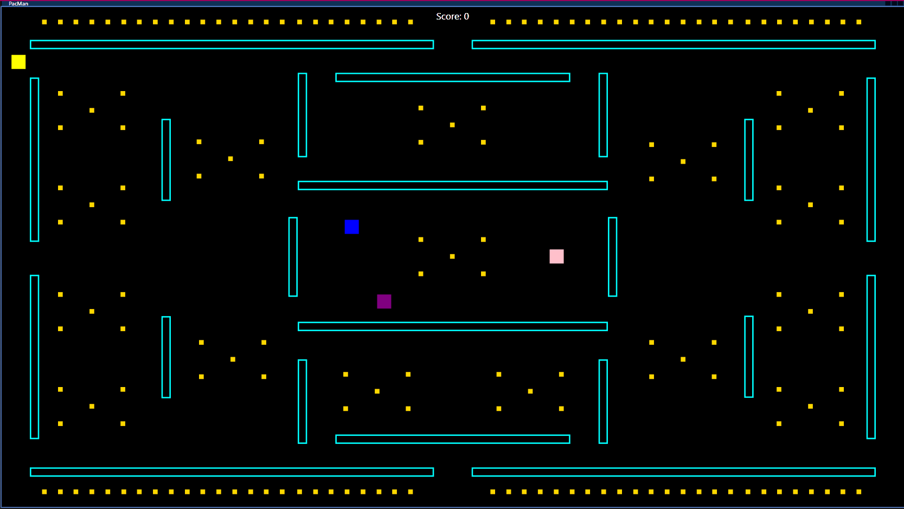
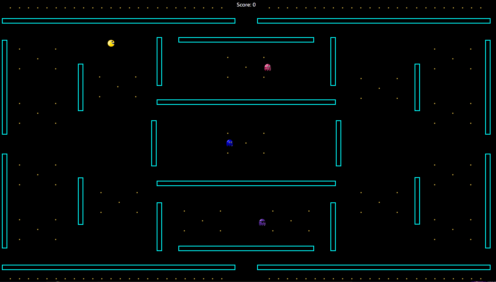

## Struktura kódu

### MainWindow.xaml.cs

Hlavní herní logika je implementována v souboru `MainWindow.xaml.cs`. Níže je rozbor klíčových komponent a metod:

#### Proměnné

- **gameTimer**: `DispatcherTimer` řídící herní smyčku.
- **Pohybové značky**: `bool` proměnné pro sledování směru, kterým se PacMan může pohybovat.
- **Proměnné pro rychlosti**: `speed`, `ghostSpeed` a `ghostStep` pro kontrolu rychlosti PacMana a duchů.
- **Skóre**: `int` pro sledování skóre hráče.
- **Hit Boxy**: `Rect` pro detekci kolizí.

#### Metody

- **MainWindow()**: Konstruktor inicializující hru.
- **CanvasKeyDown()**: Zpracovává události stisku kláves pro pohyb PacMana.
- **GameStart()**: Inicializuje herní stav a spustí herní časovač.
- **InitializePacMan()**: Načte obrázek PacMana.
- **InitializeGhosts()**: Načte obrázky duchů.
- **InitializeCoins()**: Načte obrázky mincí.
- **LoadImage(Rectangle rect, string uri)**: Načte obrázek do obdélníku.
- **GameLoop(object sender, EventArgs e)**: Hlavní herní smyčka, která aktualizuje stav hry.
- **MovePacman()**: Pohybuje PacMana podle stisknuté klávesy.
- **HandleWallCollision(Rectangle wall, Rect wallHitBox)**: Zpracovává kolize se zdmi.
- **HandleCoinCollision(Rectangle coin, Rect coinHitBox)**: Zpracovává kolize s mincemi.
- **HandleGhostCollision(Rectangle ghost, Rect ghostHitBox)**: Zpracovává kolize s duchy.
- **MoveGhost(Rectangle ghost)**: Pohybuje duchy.
- **GameOver(string message)**: Zpracovává logiku konce hry a restartuje hru.

### MainWindow.xaml

Rozložení UI je definováno v souboru `MainWindow.xaml`. Obsahuje:

- **Canvas**: Hlavní herní plocha, kde jsou umístěny všechny herní prvky.
- **Rectangle**: Představují PacMana, duchy, mince a zdi.
- **TextBlock**: Zobrazuje skóre hráče.

## Použití

- **Ovládání PacMana**: Použijte šipky na klávesnici k pohybu PacMana po bludišti.
- **Sbírání mincí**: Pohybem PacMana nad mincemi je sbírejte a zvyšujte tak své skóre.
- **Vyhýbání se duchům**: Vyhněte se kolizím s duchy, abyste neztratili hru.
- **Výhra v hře**: Sbírejte všechny mince a vyhrajte hru.

## Snímky obrazovky




## Zdroje

- Inspirováno klasickou hrou PacMan.
- Ikony a obrázky získány z různých online zdrojů.

```

Tento `Documentation.md` soubor poskytuje přehled projektu, instrukce pro nastavení, podrobné vysvětlení kódu
